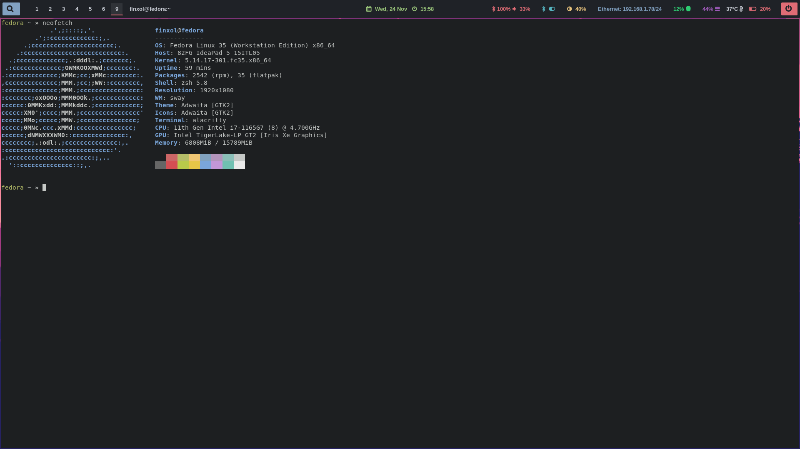
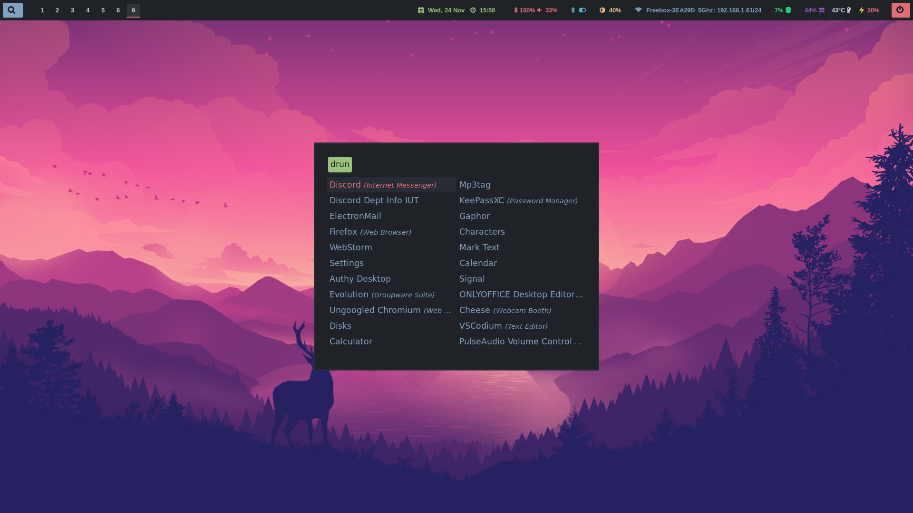

# Sway config

Dotfiles are any files or directories starting with a "." in their name. They are commonly configuration files for software on your computer, such as the ".vimrc" for Vim and ".config", a common directory for software to have their configurations stored.

This whole repo is set under public domain thanks to the Unlicense.
Please feel free to copy and/or modify these files to your liking.




## Setup

Install all the necessary packages

```bash
sudo dnf install sway rofi waybar alacritty light
```

Clone the repo and copy the contents of the .config directory to your home directory

```bash
git clone https://github.com/finxol/sway-dotfiles.git
cp -r sway-rice/.config/* ~/.config/
```

You can also copy the contents of .zshrc and .profiles, but it will still work perfectly without 

You can now reboot into sway, and it should look nice

## Fix for Java applications

Add the following to /etc/environment to use java applications like IntelliJ

```shell
if [ "$XDG_SESSION_DESKTOP" = "sway" ] ; then
    export _JAVA_AWT_WM_NONREPARENTING=1
fi
```
